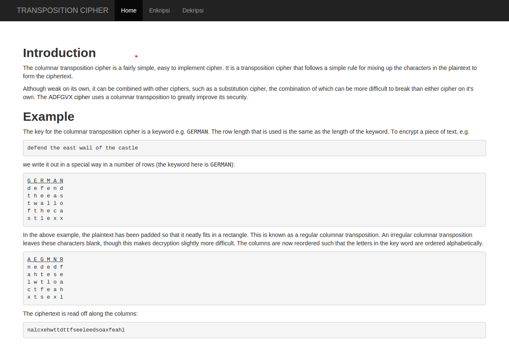
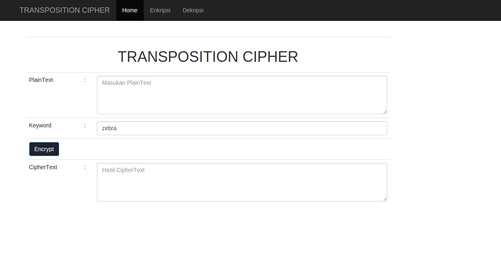
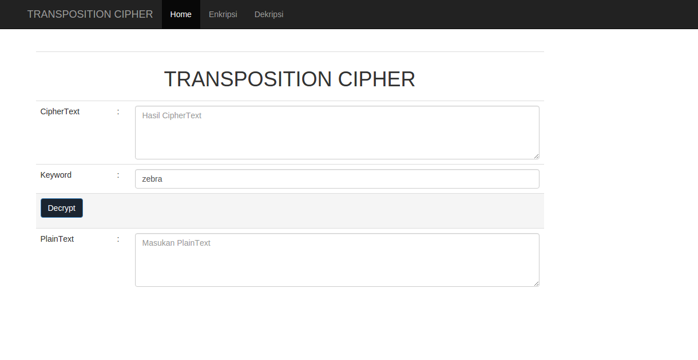

# TRANSPOSITION CIPHER

## Pendahuluan

Transposition ciphers mengatur ulang huruf-huruf dari plaintext tanpa menggantinya. Sebagai contoh, transposition cipher yang sangat sederhana adalah the rail fence, di mana plaintext ditulis per huruf dalam dua baris dan kemudian dibaca per baris untuk dijadikan ciphertext.

## Menu Pertama

## Menu Enkripsi

## Menu Dekripsi

Semoga dapat berguna dan juga dapat belajar scriptnya. ^.^

